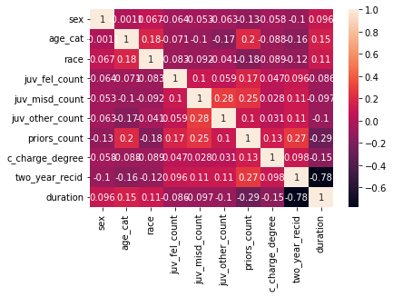
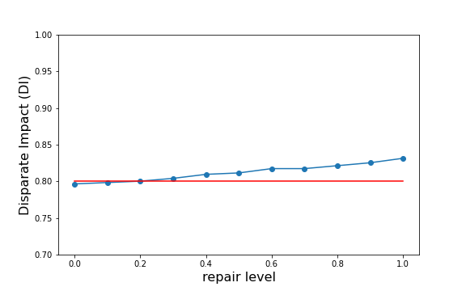
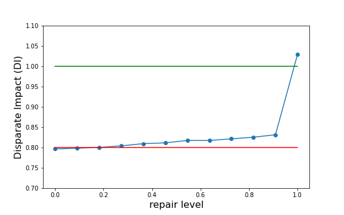

## Introduction

The fairness of the judicial system has long been a subject of concern, and the use of *fair* machine learning models and algorithms is potentially one way in which the system could be improved in terms of impartiality. There have been done attempts to automate decision-making with fairness preserving algorithms and AI models, but this has been shown to have severe limitations and be subject to differing notions of fairness. One infamous example is a risk-of-recidivism assessing algorithm for a population of US prisoners, trained using COMPAS scores (metric developed by a group of researchers that combine a variety of factors, such as age, sex, race, duration and severity of sentence). This algorithm was biased against the black population, consistently assessing as higher risk some lower-risk black individuals, and vice-verse for whites, and as such struck our attention and served as motivation for our project. 

Zooming out, it is important to recognize that bias can exist within the system at all levels, including in the decision-making processes of judges. They, like all individuals, are prone to unconscious biases and prejudices that can impact their decision-making processes. These biases can be difficult to detect and may be hidden even to the judges themselves, but they can have a significant impact on the outcomes of cases. For example, research has shown that judges are more likely to give harsher sentences to defendants of certain races or ethnicities, even when controlling for other relevant factors.

This similar bias is present in the original model that the researchers that came up with the COMPAS scores used. The model's bias is widely reported and we took it as our mission to test some standardized methods that might improve the fairness of the recidivism assessing algorithm, and by extension the judicial system. We looked at this problem from the scope of statistical fairness, and from a *We're All Equal (WAE)* standpoint, as it may be more useful when conducting large-scale decisions that are prone to discrimination by race or sex, rather than individual fairness. Other reasons for this were that it is often difficult to determine what constitutes individual fairness in complex legal cases, as there may be a wide range of factors that impact the outcome of a case. Lastly, statistical fairness may be more effective at addressing systemic biases and inequalities within the judicial system.

One possible limitation of our approach which stems from our WAE view of the world, is that it essentially assumes that "unfairness", aside from hiding in the model machinery, is deeply rooted in the data. Possible negative predispositions (eg more blacks incarcerated than whites) do not reflect different cultural or behavioral patterns in the population driven by biological factors, but are rather side-effects of eg a marginalizing society, a racist policing system, or an uninclusive education system. This in a sense means we do not trust our own data, which from a data scientist perspective might come off as rather odd, as usually data is **the only** thing a data scientist trusts, and it is the **data** that should cause any false beliefs and predispositions to crumble.

## Data

Moving on with our data, our project used the COMPAS scores dataset, which contains prisoners' personal information, criminal history, jail time, recidivist classification, and COMPAS recidivism risk score. Recidivism is the recommiting of a crime by an ex-convict, and in our dataset we had data for a 2-year time horizon after release. The personal information of prisoners includes among others their race, sex, and age, as well as their previous felonies count, juvenile felonies, felony severity, and others.

The COMPAS dataset is a popular subject for fairness-aware machine learning, as it is an excellent example of data generated from human actions and interactions where socioeconomic status may be highly correlated with sensitive information because of systemic bias. It follows then that models built on this data would inherit the bias.

We set our prediction task to be whether a convict will recommit a crime within 2 years of being released, corresponding to the feature column `2_year_recid`. Essentially, we are making our own binary risk score. Race, sex, and age could all be interpreted as sensitive fields to be discriminated against; but we decided to focus our fairness algorithms around metrics on race. The distribution of race in our dataset is as follows:

| Race             | Amount of observations |
|------------------|:----------------------:|
| African-American | 3696                   |
| Caucasian        | 2454                   |
| Hispanic         | 637                    |
| Other            | 377                    |
| Asian            | 32                     |
| Native American  | 18                     |

Because of the heavy skew of data points towards African-American and Caucasian persons, we only kept those races and discarded others. We recognize that this will make the classification task much simpler for the model. This way we could concentrate mitigating the structural racism against African-Americans. An additional benefit is to clearly have a clear demarcation between the discriminated and privileged segments of the population.   

## Fairness Pipeline

In this chapter we propose a fairness aware classification pipeline, which is based on simple logistic regression with (eventually) only two dependent variables. Then we add a combination of two pre-processing methods, disparate impact remover and reweighing. Finally, we use reject option classification as a post-processing method to further enhance the fairness in the model's predictions. Using these steps, we aim to create a machine learning model that is both accurate and fair in its predictions.

### Feature selection - Preprocessing

Our feature selection was done manually. Initially, we tried to understand what each feature of the dataset represents, which proved to be not so easy, as there is no detailed description available on the internet for the COMPAS scores dataset. After identifying unnecessary variables for the task at hand, we discarded them and were left with about 10 variables. We constructed a "duration" variable, which is the true length of a prisoner's sentence. In the end, we ended up with features related to duration, age, sex, race, and previous felonies along with their severity. We encoded all character variables to a 0-1 binary format, and normalized all of the continues values to (0, 1), so that we could reasonably interpret the coefficients of our logistic regression model. Below we can see a correlation heatmap of the final variables.

### Model

We chose logistic regression as our model, which was a decision based on two factors. First, we wanted something relatively simple computational-complexity-wise, so that we can be sure that we don't end up working with a mysterious black box. Second, logistic regression (or linear regression) provides a handy way of looking at which variables are most important for the decisions of the classifier via the coefficients, and we welcomed this explainability feature warmly. Also, since we wanted to perform binary classification (0 corresponding to prediction of no recommitting, 1 to recommitting a crime), logistic regression was suitable, and also provided sigmoid output values that can be loosely interpreted as likelihoods.

### First model and initial assessment

After training our first model on the aforementioned features, we noticed severe discrimination against blacks, with blacks being predicted to recommit a crime three times more often than whites, even though the blacks-to-whites ratio of prisoners was 1.5. Our accuracy was comparable to the researchers' model, close to $67$\%. This came as no surprise as the COMPAS scores dataset hides in it a lot of systemic bias. An easy fix that is often suggested is to simply remove the sensitive feature which we are trying to protect, in our case race, but this of course did not fix the problem. The reason is that the systemic bias embedded in the COMPAS scores is hidden inside many variables, and as such we have various correlations which cannot be easily detected. 

Our first step to mitigate some of this bias was to take a closer look at the features once more, along with the regression coefficients, and try to figure out which of the variables are causing this "racist" model behavior. After experimenting and brainstorming a bit, we trained a new model only on the duration and previous felonies features, and we achieved a much higher accuracy of around $87$\%, with a predicted blacks-to-whites recommitting ratio of 2.2. We were happy that this "sanity-check" step seemed to work in favor of our desired direction, and we proceeded to apply three standard bias mitigation methods we learned in the course, namely Disparate Impact Remover, Reweighing and Reject Option Classification. These were all done one after the other in a pipeline fashion. The AI Fairness 360 open source toolkit provides an implementation of all three, which we used.

### Disparate impact remover

Disparate Impact Remover is a bias mitigation pre-processing technique. Disparate Impact is a metric that evaluates fairness by comparing the proportion of individuals that receive a positive prediction for two groups, a privileged one and an unprivileged one. In our case it would look like the following ratio:

$$ \frac{Pr(Y=recommit | D=black)}{Pr(Y=recommit | D=white)} $$

The AI 360 Fairness tool states that if the unfavored group receives a positive prediction less than 90\% of their proportion of the privileged group (ideal value of 1), then this constitutes a violation of disparate impact. It is as such very suitable for what we want to measure with our model. 

After trying out different repair level values for our Disparate Impact Remover, we found that a repair level of 1 achieved the best result for our case, which was nevertheless below the AIF360 threshold. After this step the predicted blacks-to-whites ratio dropped to 2.1.

### Reweighing

Another pre-processing technique to mitigate bias is Reweighing. Reweighing involves adjusting the importance or weight given to different groups within the training data.

In our case, the African-Americans are highly overrepresented. This can be thought to be the result of decades of over-policing and structural discrimination. To address this issue we can decrease the weight of the African-American examples in the training data of our model. Making the model less likely to discriminate against them. After applying this step we tested again the Disparate Impact, and found a notable improvement while also having a slight increase in model accuracy:

It is both justified by moral reasoning and with the accuracy of our model that the weights of African-American data subjects should be decreased. As their over-presence in the data is in some sense due to the biases held by police and judicial system. At the end of this step the predicted blacks-to-whites ratio became 1.5, which is identical to the actual blacks-to-whites prisoners in the dataset.

### Reject Option Classification

ROC is a post-processing fairness aware algorithm. In this implementation ROC only works with binary labels, which suits our prediction task and logistic regression model. 

ROC is considered as a post-processing technique because it intervenes after the model outputs the probabilities for each datapoint. To apply ROC, we first train the reject option classifier on the training data probabilities, where it first finds the optimal classification boundary with respect to accuracy and then a margin with respect to a passed fairness metric. The margin is an interval centered around the decision boundary where all privileged groups are given the unfavorable outcome and unprivileged groups the favorable one. This comes from the assumption that biased outcomes from the model will tend to be the most uncertain. We chose to optimize based on the statistical parity difference metric. This metric calculates the difference of the ratios of predicted recidivist african-americans to predicted recidivist caucasians and of number of african-americans in the dataset to number of caucasians in the dataset. After this step we obtain the following metrics:

| Metric             | Value |
|------------------|:----------------------:|
| Accuracy | 0.89                   |
| Statistical parity difference        | -0.0099                   |
| Disparate Impact         | 0.98                    |
| Average odds difference            | -0.02                    |
| Equal opportunity difference            | -0.04                     |
| Theil index  | 0.1155                     |

We see that ROC actually improves all important metrics, which is surprising as the expectation is to see a tradeoff between fairness and accuracy. However, in the context of ROC, it follows intuitively that by switching some of the most uncertain labels you may improve the accuracy of the test predictions. 

This concludes the fairness aware pipeline. 

## Conclusion

In conclusion, our machine learning classifier for predicting inmate recidivism has shown promising results in its ability to accurately and fairly predict recidivism rates. However, we are aware that the bias present in the judicial system can significantly impact the accuracy of our model as even the variables we are striving to predict can be biased.

The training data can be assumed to be biased as has been displayed by the reporting on COMPAS and we have tried to counter this by the various pre- and post-processing methods discussed in previous chapters. 

Despite these limitations, we remain hopeful that our model can be a valuable tool for helping to predict and prevent recidivism rates among inmates. However, it is important to continuously assess and address the potential biases present in the data and the judicial system.

A natural extension for this line of work is to broaden the use of fairness-aware machine learning in the context of legal judicial systems. If used properly, these methods can aid in eliminating the bias that is embedded in various levels of the system, from personal biases of the judges, to widespread systemic biases in policing, education and society in general. 

If a judicial institution would opt to use our model, we would recommend to include more racial groups, and a larger amount of people from each racial group ($n > 1000$). Even though the model has displayed fair treatmeant of unprivileged groups, we would always recommend human supervision of the decisions, as there might be slips between the cracks and cases where equivalent people are treated differently solely based on a sensitive feature such as race or gender. All in all, this would definitely provide an improvement to the current system, but it is still early to blindoldingly trust fairness-aware machine learning methods, and much research work remains to be done.
